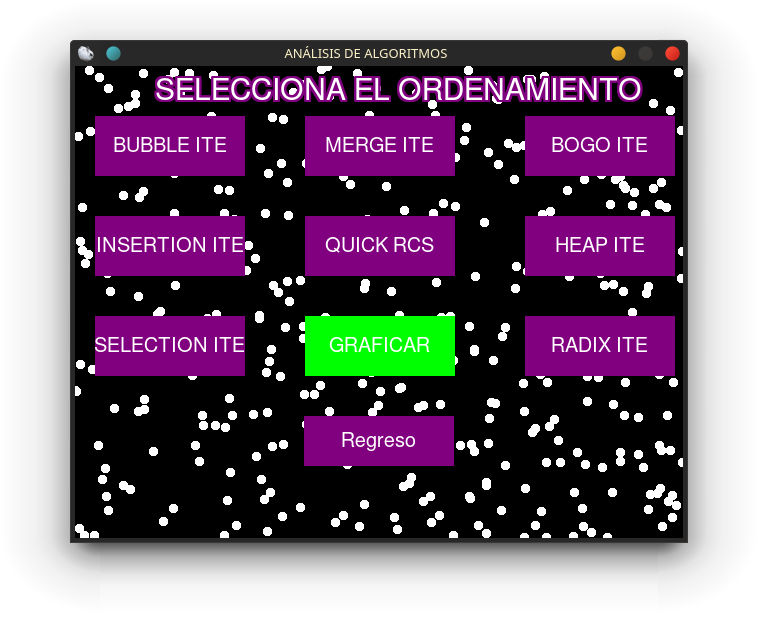
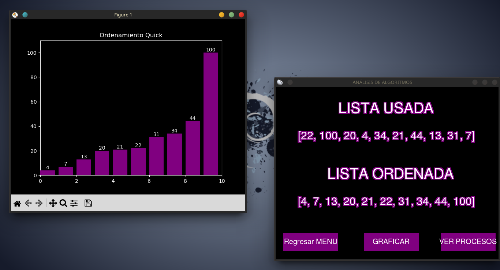

# Proyecto-Ordenamientos
Este proyecto consiste en el analisis de algoritmos de ordenamiento. Donde se analiza rendimiento, uso de graficas comparativas y ordenamientos en tiempo real.
Su funcionamiente consiste en que el usuario ingresa una lista de numeros o una oracion. Con la opcion de ser ingresada o ser generada aletoriamente.

Donde se puede seleccionar distintos tipos de ordenamientos

Al igual de poder comparar de distintas formas de ordenamiento. Con esto se verifica que ordenamiento es mas eficiente

Si se selecciona un ordenamiento en especifico, se visualizara la lista ordenada. Otras opciones que tiene; Es la posibilidad
de visualizar el ordenamiento en tiempo real con el uso de mathplot y la eficiencia del algoritmo con cProfile.

#### NOTA
Debido a que el proyecto en su mayoria uso pygame, cuando se grafica o el uso de cProfile las ventanas generadas quedan trabadas. 
Por lo cual basta con cerrar la ventana con alt+f4 o usando icono de cerrar, para poder continuar usando el programa principal con normalidad.
